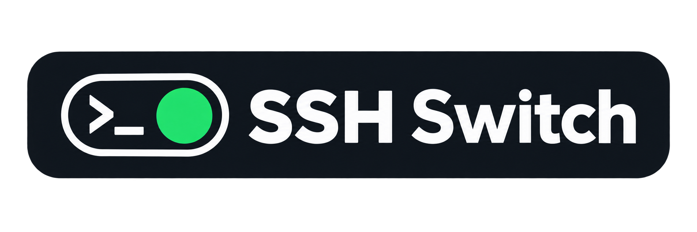
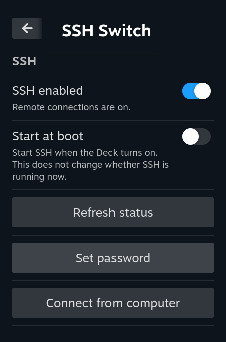
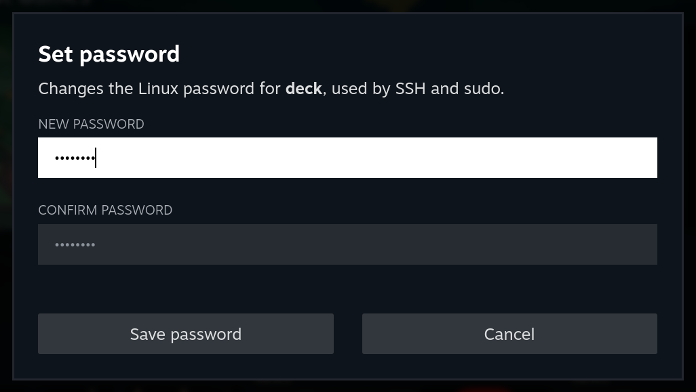

<p align="center">
  
</p>

# SSH Switch

A small Decky Loader plugin for Steam Deck:

- **SSH enabled** starts or stops SSH now.
- **Start at boot** enables or disables SSH at system startup, independently of whether it is running now.
- **Set password** opens a dialog to change the user's Linux account password (normally `deck`).
- **Connect from computer** shows connection details for mounting the Deck's files on Windows, Linux or macOS.

## Screenshots

<p align="center">
  <a href="assets/screenshots/ssh-controls.png"></a>
  <a href="assets/screenshots/password-form.png"></a>
</p>

## Install

This plugin is made for SteamOS (Steam Deck) with OpenSSH (`sshd.service`) and Decky Loader installed. The plugin needs the `root` permission to control system services and change the local account password.

Install `ssh-switch-<version>.zip` from the repository's **Releases** page. The `-source.zip` archive is for development.

Copy the release ZIP to the Deck. Enable Developer Mode in Decky's settings, open its Developer page, and use **Install Plugin from ZIP File** to select it. If your Decky version only offers a ZIP URL, use a directly downloadable URL for the same release archive, or install manually below.

For a manual install, extract the ZIP in Desktop Mode. Copy the extracted `decky-ssh` folder into `~/homebrew/plugins/`, then restart.

## Mount files on your computer

Enable SSH and open **Connect from computer** on the Deck. Keep both devices on the same network.

Install the dependency for your computer:

- **Windows:** [SSHFS-Win and WinFsp](https://github.com/winfsp/sshfs-win), using `winget install --id SSHFS-Win.SSHFS-Win --exact --source winget`.
- **Linux:** SSHFS from your package manager, e.g. `sudo apt install sshfs` on Ubuntu/Debian.
- **macOS:** [FUSE-T and SSHFS](https://github.com/macos-fuse-t/fuse-t#installing-from-brew), using `brew install macos-fuse-t/homebrew-cask/fuse-t macos-fuse-t/homebrew-cask/sshfs-fuse-t`.

Extract a release ZIP on your computer, open a terminal in its `decky-ssh` folder, and run:

| Computer | Command |
| --- | --- |
| Windows (PowerShell) | `powershell -NoProfile -ExecutionPolicy Bypass -File .\mount\mount-windows.ps1` |
| Linux | `bash mount/mount-linux.sh` |
| macOS | `bash mount/mount-macos.sh` |

Enter the address, port, username and remote folder shown on the Deck, then choose a drive letter or local folder. Compare the SSH fingerprint when prompted and enter your Deck password.

On Windows, keep the script open; close files on the drive and press Enter to disconnect. Linux and macOS print the command to unmount when finished.

## Build and test

Requires Node.js 20+ and Python 3.10+.

```sh
npm ci
npm test
npm run package
npm run verify-package
```

Release ZIPs are written to `release/`. Run `npm run clean` to remove generated files.

## CI/CD and releases

Publish the contents of this `decky-ssh` directory as the repository root. The workflow is `.github/workflows/build-release.yml`.

- Every branch push and pull request runs the tests, type-checks, builds and verifies both ZIPs. The archives and checksums are available as workflow artifacts for 14 days.
- Pushing a version tag such as `v0.2.0` runs the same checks, then creates a GitHub Release containing the installable ZIP, source ZIP and `SHA256SUMS`. The tag must match `package.json` and `package-lock.json`.
- Tags such as `v0.2.0-beta.1` produce prereleases. The workflow can also be run manually; selecting a version tag enables publishing, while selecting a branch only builds artifacts.

After committing and pushing this project to GitHub, publish the current version with:

```sh
git tag v0.2.0
git push origin v0.2.0
```

For subsequent releases, run `npm version patch` (or `minor` / `major`) in a clean Git checkout, then push the commit and generated tag with `git push origin HEAD --follow-tags`.

## Development references

- [Decky plugin template and packaging](https://github.com/SteamDeckHomebrew/decky-plugin-template)
- [Decky plugin runtime and host-account environment](https://github.com/SteamDeckHomebrew/decky-loader/blob/main/backend/decky_loader/plugin/sandboxed_plugin.py)
- [systemctl command semantics](https://www.freedesktop.org/software/systemd/man/latest/systemctl.html)
- [chpasswd documentation](https://github.com/shadow-maint/shadow/blob/master/man/chpasswd.8.xml)
- [Linux password hashing API](https://manpages.debian.org/testing/libcrypt-dev/crypt.3.en.html)
- [GitHub Actions workflow syntax](https://docs.github.com/en/actions/reference/workflows-and-actions/workflow-syntax)
